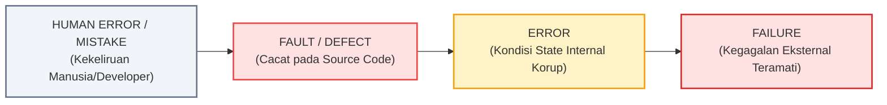

# LAPORAN ROOT CAUSE ANALYSIS (RCA) & ANALISIS PENGUJIAN SISTEM

**Mata Kuliah** : Analisis dan Pengujian Sistem  
**Penyusun**    : Zainul Mutawakkil  
**NIM**         : 23EO10003  
**Topik**       : Identifikasi Defect/Fault, Root Cause Analysis (RCA), dan Verifikasi Perbaikan pada Mini E-Commerce Order System  
**Tanggal**     : Oktober 2026  

---

## 1. Ringkasan Eksekutif & Gambaran Sistem

Dalam rekayasa perangkat lunak modern, sistem pemrosesan transaksi *e-commerce* menuntut keandalan (*reliability*), konsistensi data (*data integrity*), dan ketahanan terhadap konkurensi tinggi. Pada proyek ini dibangun sebuah *mini repository* sistem pemesanan barang (*Order & Inventory Management*) yang terdiri dari komponen:
- `shop.models`: Definisi entitas produk, pelanggan, pesanan, dan status transaksi.
- `shop.inventory`: Pengelolaan ketersediaan stok fisik barang di gudang.
- `shop.pricing`: Kalkulator moneter, kupon diskon, dan perpajakan (PPN).
- `shop.payment`: Simulasi gateway otorisasi pembayaran pihak ketiga (*third-party payment gateway*).
- `shop.order_service`: Koordinator alur kerja (*orchestrator*) pembuatan pesanan hingga pembayaran.

Melalui pengujian empiris berbasis *automated testing*, ditemukan **3 defect/fault kritis** yang dapat menimbulkan kerugian finansial langsung bagi bisnis dan merusak integritas basis data.

---

## 2. Landasan Teori: Taksonomi Kegagalan Software

Berdasarkan standar IEEE 610.12 dan prinsip Pengujian Perangkat Lunak, terdapat perbedaan mendasar antara tiga istilah yang sering tertukar:



1. **Human Error / Mistake**: Kekeliruan kognitif atau asumsi salah oleh pengembang saat merancang algoritma atau menulis sintaks.
2. **Fault / Defect**: Representasi statis dari kekeliruan tersebut di dalam baris kode sumber (*source code*) atau konfigurasi sistem.
3. **Error**: Kondisi dinamis di memori runtime saat eksekusi mencapai baris kode cacat, menyebabkan keadaan (*internal state*) sistem menyimpang dari spesifikasi yang diharapkan.
4. **Failure**: Manifestasi eksternal dari error yang teramati oleh pengguna akhir (*user*), sistem eksternal, atau *test runner*, berupa *crash*, hasil kalkulasi keliru, atau anomali data.

---

## 3. Analisis Defect 1: Concurrency Race Condition (Inventory Overselling)

### 3.1. Deskripsi Gejala & Manifestasi Kegagalan (Failure)
Saat produk yang sedang *flash sale* hanya menyisakan **1 unit** di gudang, terdapat 10 permintaan checkout dari pelanggan berbeda yang tiba pada milidetik yang sama. Hasil pengujian menunjukkan **10 transaksi berhasil disetujui**, dan stok akhir barang menjadi **-9 (minus sembilan)**.

### 3.2. Rantai Propagasi Kegagalan
- **Fault**: Baris kode `inventory.py` melakukan pemisahan antara pengecekan stok (`if self._products[sku].stock >= quantity:`) dan pengurangan stok (`self._products[sku].stock -= quantity`) tanpa sinkronisasi *thread-safety*.
- **Error**: Terjadi *Time-of-Check to Time-of-Use* (TOCTOU) *race condition*. Sebelum thread 1 sempat mengurangi nilai stok di memori, thread 2 hingga thread 10 sudah membaca nilai stok lama (nilai 1) yang dianggap masih valid.
- **Failure**: Barang terjual melebihi kapasitas fisik gudang (*overselling*), mengakibatkan komplain pelanggan dan kerugian operasional akibat pembatalan sepihak.

### 3.3. Analisis Akar Masalah (5-Whys)
1. *Why 1*: Mengapa stok barang bisa bernilai negatif (-9)?  
   $\rightarrow$ Karena 10 transaksi berhasil melakukan pemotongan stok pada saat stok hanya tersisa 1.
2. *Why 2*: Mengapa 10 transaksi bisa sama-sama disetujui?  
   $\rightarrow$ Karena seluruh 10 thread mendeteksi kondisi stok $\ge 1$ terpenuhi.
3. *Why 3*: Mengapa 10 thread mendeteksi kondisi yang sama pada waktu bersamaan?  
   $\rightarrow$ Karena pembacaan status stok dilakukan secara paralel sebelum ada thread yang memperbarui status terbaru.
4. *Why 4*: Mengapa operasi baca-kurang tidak dieksekusi secara atomik?  
   $\rightarrow$ Tidak ada implementasi mekanisme *mutual exclusion* (locking) pada critical section data stok.
5. *Why 5 (Root Cause)*: Pengembang mengasumsikan operasi in-memory bersifat atomic dan tim QA tidak memiliki skenario *concurrency load testing* sebelum kode dinaikkan ke production.

### 3.4. Diagram Ishikawa (Fishbone Diagram)
```
[MAN]                                           [MACHINE]
Kurang pemahaman konsep race condition          Lingkungan eksekusi multi-core / multi-thread
Asumsi keliru operasi memori otomatis atomik    Tingginya frekuensi context switching
                    \                               /
                     \                             /
                      +----[ INVENTORY OVERSELLING ]----+
                     /                             \
                    /                               \
Tidak ada unit test berbasis thread konkurensi  Spesifikasi kebutuhan tidak merinci load concurrent
Ketiadaan Concurrency Code Review Checklist     Tidak ada batas isolasi database transaksi
[METHOD]                                        [MATERIAL / ENVIRONMENT]
```

### 3.5. Solusi Teknis & Perbandingan Kode
Menggunakan **Reentrant Mutex Lock** (`threading.RLock`) atau *Atomic Check-and-Set pattern*:

```python
# SEBELUM (Vulnerable - Race Condition)
def deduct_stock(self, sku: str, quantity: int) -> bool:
    if self._products[sku].stock >= quantity:
        time.sleep(0.005) # Context switch terjadi di sini
        self._products[sku].stock -= quantity
        return True
    return False

# SESUDAH (Fixed - Thread-Safe Critical Section)
def deduct_stock(self, sku: str, quantity: int) -> bool:
    with self._lock:  # Critical section terkunci rapat
        if self._products[sku].stock >= quantity:
            time.sleep(0.005)
            self._products[sku].stock -= quantity
            return True
        return False
```

---

## 4. Analisis Defect 2: Floating-Point Leak & Unbounded Discount Boundary Flaw

### 4.1. Deskripsi Gejala & Manifestasi Kegagalan (Failure)
1. Pembeli yang membeli 3 unit permen seharga Rp 0,1 per unit menghasilkan subtotal `Rp 0.30000000000000004` pada basis data invoice.
2. Pembeli memesan buku seharga Rp 100.000, lalu memasukkan kupon diskon 50% (Rp 50.000) dan voucher promosi Rp 70.000. Total diskon menjadi Rp 120.000, dan sistem menghasilkan total tagihan akhir **-Rp 22.200**. Toko wajib membayar pelanggan saat checkout.

### 4.2. Rantai Propagasi Kegagalan
- **Fault**:
  1. Penggunaan tipe data primitif `float` IEEE 754 untuk entitas keuangan moneter.
  2. Fungsi `calculate_totals` tidak memiliki validasi batas maksimum (*ceiling cap*) akumulasi diskon terhadap subtotal belanja.
- **Error**:
  1. Nilai biner basis 2 tidak dapat merepresentasikan pecahan desimal basis 10 secara eksak, menciptakan residu desimal.
  2. Variabel `taxable_amount` bernilai negatif (-20.000), sehingga kalkulasi pajak juga menghasilkan nilai negatif (-2.200).
- **Failure**: Pembukuan keuangan harian tidak seimbang (*rounding leakage/audit discrepancy*) dan kebocoran dana (*revenue loss*) akibat tagihan bernilai minus.

### 4.3. Analisis Akar Masalah (5-Whys)
1. *Why 1*: Mengapa total tagihan belanja bernilai negatif (-Rp 22.200)?  
   $\rightarrow$ Karena total potongan diskon lebih besar dari harga barang yang dibeli.
2. *Why 2*: Mengapa diskon bisa lebih besar dari subtotal?  
   $\rightarrow$ Sistem menggabungkan diskon persentase dan diskon nominal secara aditif tanpa validasi batas atas.
3. *Why 3*: Mengapa tidak ada pembatasan diskon?  
   $\rightarrow$ Developer mengimplementasikan rumus promo secara parsial tanpa memasukkan *business invariant rule* (Harga $\ge 0$).
4. *Why 4*: Mengapa terdapat pecahan desimal ganjil pada struk transaksi?  
   $\rightarrow$ Menggunakan tipe data `float` standar yang menggunakan representasi biner aproksimatif.
5. *Why 5 (Root Cause)*: Kurangnya penerapan *Domain-Driven Design* untuk tipe data uang (*Money Pattern*) serta ketiadaan pengujian nilai batas (*Boundary Value Analysis / BVA*) pada modul kalkulasi harga.

### 4.4. Diagram Ishikawa (Fishbone Diagram)
```
[MAN]                                           [MACHINE]
Kebiasaan memakai tipe float untuk kalkulasi    Karakteristik IEEE 754 floating-point hardware
Kelalaian memvalidasi kombinasi aturan diskon   Binary round-off error akumulatif
                    \                               /
                     \                             /
                      +----[ HARGA MINUS & INEXACT ]----+
                     /                             \
                    /                               \
Tidak ada Boundary Value Analysis (BVA) test    Spesifikasi marketing promo ambigu (stackable?)
Tidak menggunakan Money / Currency Value Object Tidak ada constraint database (CHECK price >= 0)
[METHOD]                                        [MATERIAL / ENVIRONMENT]
```

### 4.5. Solusi Teknis & Perbandingan Kode
Migrasi ke pustaka `decimal.Decimal` dan penegakan *ceiling cap* batas diskon:

```python
# SEBELUM (Vulnerable)
def calculate_totals(self, items, percentage_discount, fixed_discount):
    subtotal = sum(item.quantity * item.unit_price for item in items)
    total_discount = (subtotal * (percentage_discount / 100.0)) + fixed_discount
    taxable_amount = subtotal - total_discount  # Bisa minus!
    tax = taxable_amount * self.tax_rate
    return {"total": taxable_amount + tax}

# SESUDAH (Fixed)
def calculate_totals(self, items, percentage_discount, fixed_discount):
    subtotal = sum(Decimal(str(i.quantity)) * Decimal(str(i.unit_price)) for i in items)
    safe_pct = max(0.0, min(100.0, percentage_discount))
    disc_pct = subtotal * (Decimal(str(safe_pct)) / Decimal("100"))
    disc_fixed = max(Decimal("0.00"), Decimal(str(fixed_discount)))
    # Batasi total diskon maksimal setara subtotal
    effective_discount = min(disc_pct + disc_fixed, subtotal)
    taxable_amount = max(Decimal("0.00"), subtotal - effective_discount)
    tax = (taxable_amount * self.tax_rate).quantize(Decimal("0.01"), rounding=ROUND_HALF_UP)
    total = (taxable_amount + tax).quantize(Decimal("0.01"), rounding=ROUND_HALF_UP)
    return {"total": total, "discount": effective_discount}
```

---

## 5. Analisis Defect 3: Phantom Stock Deduction (No Transaction Rollback)

### 5.1. Deskripsi Gejala & Manifestasi Kegagalan (Failure)
Pelanggan mencoba membeli 2 unit smartphone (stok awal 5 unit). Saat alur pembayaran diproses, terjadi kegagalan otorisasi (*Network Timeout HTTP 504* pada bank gateway). Sistem menampilkan notifikasi *“Order Failed”* kepada pelanggan dan saldo tidak terpotong. Namun, saat admin mengecek gudang, stok produk berkurang menjadi 3 unit dan **tidak pernah kembali**. Sebanyak 2 unit barang lenyap (*phantom deduction*).

### 5.2. Rantai Propagasi Kegagalan
- **Fault**: Metode `checkout` pada `VulnerableOrderService` mengeksekusi `inventory.deduct_stock()` sebelum memastikan pembayaran berhasil, dan blok `except PaymentError` hanya mengubah status pesanan tanpa memanggil fungsi restorasi stok (`restore_stock`).
- **Error**: State *inventory* dan state *order* berada dalam kondisi inkonsisten (*partial state mutation*). Mutasi pada database stok bersifat permanen meskipun alur transaksi utama gagal.
- **Failure**: Kehilangan pencatatan inventori (*phantom inventory leak*), barang menjadi tidak bisa dibeli oleh pelanggan lain padahal masih tersedia secara fisik.

### 5.3. Analisis Akar Masalah (5-Whys)
1. *Why 1*: Mengapa stok barang berkurang padahal pesanan berstatus GAGAL?  
   $\rightarrow$ Karena pengurangan stok terjadi di langkah awal sebelum verifikasi pembayaran.
2. *Why 2*: Mengapa stok tidak dikembalikan saat pembayaran gagal?  
   $\rightarrow$ Blok penanganan error (`except`) tidak mengeksekusi fungsi pemulihan stok.
3. *Why 3*: Mengapa tidak ada perintah pemulihan stok?  
   $\rightarrow$ Layanan checkout tidak dirancang dengan prinsip transaksi atomik (*All-or-Nothing / ACID*).
4. *Why 4*: Mengapa sistem multi-langkah tidak memiliki mekanisme transaksi atomik?  
   $\rightarrow$ Pengembang hanya fokus menyelesaikan skenario keberhasilan (*happy-path development*) tanpa merancang *compensating transaction*.
5. *Why 5 (Root Cause)*: Ketiadaan arsitektur transaksi terdistribusi (seperti *Saga Pattern / Two-Phase Commit*) dan minimnya pengujian jalur kegagalan (*Negative & Fault-Injection Testing*).

### 5.4. Diagram Ishikawa (Fishbone Diagram)
```
[MAN]                                           [MACHINE]
Fokus hanya pada 'Happy Path' alur transaksi    Network latency / timeout tak terduga pada 3rd-party
Kurang kesadaran konsep transaksi atomik/Saga   Koneksi socket terputus saat request charge
                    \                               /
                     \                             /
                      +----[ PHANTOM INVENTORY LOSS ]----+
                     /                             \
                    /                               \
Tidak ada skenario Fault-Injection Testing      Ketiadaan mekanisme database Transaction Rollback
Penanganan exception 'swallowing' tanpa cleanup Tidak ada sistem antrian rekonsiliasi berkala
[METHOD]                                        [MATERIAL / ENVIRONMENT]
```

### 5.5. Solusi Teknis & Perbandingan Kode
Menerapkan pola **Compensating Transaction / Unit-of-Work Rollback Pattern**:

```python
# SEBELUM (Vulnerable)
def checkout(self, customer, items, ...):
    for item in items:
        self.inventory.deduct_stock(item.sku, item.quantity)
    try:
        self.gateway.process_charge(...)
    except PaymentError as err:
        order.status = OrderStatus.FAILED
        return order # BUG: Stok dibiarkan hilang!

# SESUDAH (Fixed)
def checkout(self, customer, items, ...):
    allocated_items = []
    try:
        for item in items:
            if not self.inventory.deduct_stock(item.sku, item.quantity):
                self._rollback_inventory(allocated_items)
                return order
            allocated_items.append(item)
            
        self.gateway.process_charge(...)
        return order
    except Exception as err:
        # KOMPENSASI MUTLAK: Kembalikan semua stok yang telah terpotong
        self._rollback_inventory(allocated_items)
        order.status = OrderStatus.FAILED
        return order
```

---

## 6. Corrective and Preventive Action (CAPA) Matrix

| Defect ID | Defect Name | Corrective Action (Tindakan Korektif Jangka Pendek) | Preventive Action (Tindakan Preventif Jangka Panjang) | Penanggung Jawab |
|---|---|---|---|---|
| **DEF-01** | *Concurrency Race Condition (Oversell)* | Implementasi `threading.RLock` pada modul inventory untuk critical section read-modify-write. | Menambahkan *Concurrency & Stress Testing* pada pipeline CI/CD menggunakan k6/Locust; menerapkan *pessimistic/optimistic locking* di database. | Backend Lead & QA Engineer |
| **DEF-02** | *Float Precision & Unbounded Discount* | Refactoring ke tipe data `Decimal` dan menambahkan validasi ceiling cap `min(discount, subtotal)`. | Menerapkan *Domain Value Object* `Money` di seluruh arsitektur; mewajibkan *Boundary Value Analysis* (BVA) pada spesifikasi bisnis promo. | Core Software Engineer & Business Analyst |
| **DEF-03** | *Phantom Inventory Deduction (No Rollback)* | Menambahkan blok kompensasi `try-except-rollback` pada service checkout. | Menerapkan *Saga Orchestrator Pattern* atau *Distributed Two-Phase Commit*; membuat *Reconciliation Cron Job* otomatis setiap 1 jam. | Software Architect & DevOps |

---

## 7. Rekomendasi Best Practices Pengujian Perangkat Lunak

Untuk menjamin kualitas dan stabilitas sistem jangka panjang, disarankan implementasi metodologi pengujian berikut:

1. **Piramida Pengujian (Test Pyramid)**:
   - *Unit Tests*: Memverifikasi boundary input (diskon negatif, kupon > 100%, presisi desimal).
   - *Integration Tests*: Memverifikasi interaksi antar modul inventory, pricing, dan gateway mock.
   - *End-to-End Tests*: Memverifikasi skenario belanja pengguna secara menyeluruh.
2. **Concurrency & Thread-Safety Testing**:
   - Memanfaatkan *barrier synchronization* atau *thread pooling* untuk mereproduksi lonjakan akses secara simultan pada sumber daya terbatas.
3. **Fault-Injection Testing (Chaos Engineering)**:
   - Secara sengaja menyuntikkan kegagalan jaringan, timeout, atau database error pada saat transaksi berlangsung untuk memastikan integritas rollback.
4. **Code Quality Gates**:
   - Mengintegrasikan linter statis (`flake8`, `mypy`) dan *mutation testing* (`mutmut`) untuk mendeteksi celah logika sebelum *merge request* disetujui.

---

**Disusun oleh:**  
Zainul Mutawakkil (NIM: 23EO10003)  
Program Studi Teknik Informatika / Sistem Informasi  
Mata Kuliah: Analisis dan Pengujian Sistem
